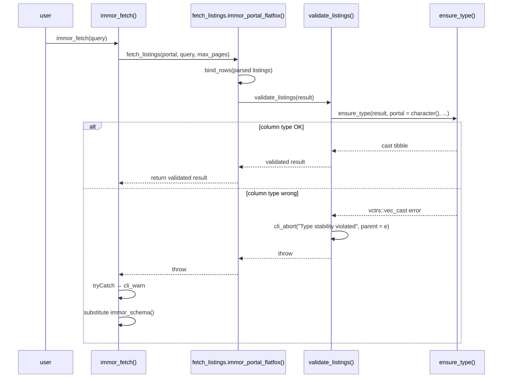
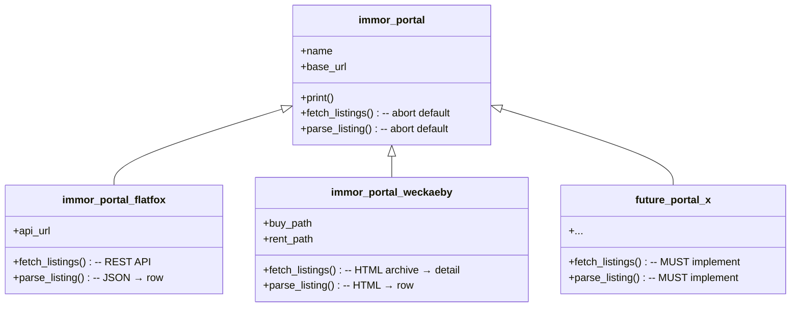

# immor — architectural map

The English onboarding lens into immor's architecture. The **authoritative contract** for every capability lives under [`/openspec/specs/`](/openspec/specs/); this document is the human-reading entry point that links into it.

- If you want to know **what the system MUST do**, read the relevant [`/openspec/specs/<capability>/spec.md`](/openspec/specs/).
- If you want to know **why the system is shaped this way**, read this document.
- If you get lost in the vocabulary (CasaWP, `pk`, "common denominator schema"), read [glossary.md](glossary.md).
- If you're wondering "when will X be done?" read [roadmap.md](roadmap.md).

---

## What immor does

immor ("immobilier" + "R", sounds like "immortal") scrapes real estate listings from Swiss property portals, normalises them into a 28-column tibble, and provides type-safe deduplication. It is the data engine behind [`blockr.immor`](https://github.com/Layalchristine24/blockr.immor).

The public API is intentionally tiny — **nine exported functions** — which map one-to-one to nine capability specs:

| Function | Capability | R file |
|---|---|---|
| `immor_fetch()` | [multi-portal-fetch](/openspec/specs/multi-portal-fetch/spec.md) | [`/R/fetch-all.R`](/R/fetch-all.R) |
| `immor_query()` | [query-construction](/openspec/specs/query-construction/spec.md) | [`/R/query.R`](/R/query.R) |
| `immor_schema()` | [listing-schema](/openspec/specs/listing-schema/spec.md) | [`/R/schema.R`](/R/schema.R) |
| `ensure_type()` | [type-enforcement](/openspec/specs/type-enforcement/spec.md) | [`/R/ensure_type.R`](/R/ensure_type.R) |
| `new_portal()`, `immor_portals()`, `immor_portal()`, `fetch_listings()`, `parse_listing()` | [portal-registry](/openspec/specs/portal-registry/spec.md) | [`/R/portal.R`](/R/portal.R), [`/R/portals.R`](/R/portals.R) |
| `portal_flatfox()` | [portal-flatfox](/openspec/specs/portal-flatfox/spec.md) | [`/R/portal-flatfox.R`](/R/portal-flatfox.R) |
| `portal_weckaeby()` | [portal-weckaeby](/openspec/specs/portal-weckaeby/spec.md) | [`/R/portal-weckaeby.R`](/R/portal-weckaeby.R) |
| `immor_deduplicate()` | [deduplication](/openspec/specs/deduplication/spec.md) | [`/R/deduplicate.R`](/R/deduplicate.R) |
| — (internal) — `immor_request()` | [http-layer](/openspec/specs/http-layer/spec.md) | [`/R/http.R`](/R/http.R) |

---

## How the code flows

```mermaid
flowchart TD
    Q["immor_query()<br/>no-arg S3 constructor"] --> F["immor_fetch(query, portals, deduplicate, max_pages)"]

    F -->|for each portal in immor_portals()| DISP{"S3 dispatch<br/>fetch_listings(portal, query, max_pages)"}

    DISP -->|"class = immor_portal_flatfox"| FF["fetch_listings.immor_portal_flatfox()<br/>REST API<br/>offset / limit pagination"]
    DISP -->|"class = immor_portal_weckaeby"| WW["fetch_listings.immor_portal_weckaeby()<br/>HTML scraping<br/>archive → detail"]

    FF -->|"httr2 request<br/>decorated by immor_request()"| HTTP1[["flatfox.ch<br/>/api/v1/public-listing/"]]
    WW -->|"httr2 request<br/>decorated by immor_request(delay = 10)"| HTTP2[["weck-aeby.ch<br/>/acheter/, /louer/, /objet/…"]]

    HTTP1 --> PF["parse_listing.immor_portal_flatfox()<br/>raw JSON → 1 row"]
    HTTP2 --> PW["parse_listing.immor_portal_weckaeby()<br/>raw HTML → 1 row"]

    PF --> VF["validate_listings()<br/>ensure_type() at portal boundary"]
    PW --> VW["validate_listings()<br/>ensure_type() at portal boundary"]

    VF --> AGG["dplyr::bind_rows(...)<br/>aggregate across portals"]
    VW --> AGG

    AGG -->|"deduplicate = TRUE"| DED["immor_deduplicate()<br/>exact match on<br/>(zip, street, rooms, price)"]
    AGG -->|"deduplicate = FALSE"| OUT
    DED --> OUT["tibble result<br/>28 columns, N rows"]

    style Q fill:#e1f5ff
    style OUT fill:#e1f5ff
    style DISP fill:#fff4e1
    style VF fill:#ffe1e1
    style VW fill:#ffe1e1
```

Every arrow that crosses a labelled box in this diagram crosses a **contract boundary** that is spelled out in one of the nine capability specs. Follow the capability map below to descend from any node into its contract.

---

## Capability map

Start with the umbrella, then descend as needed.

| Capability | What it covers | Spec |
|---|---|---|
| `multi-portal-fetch` | **Umbrella — start here.** `immor_fetch()` orchestration, per-portal error isolation, aggregation, optional dedup, pagination cap. | [`/openspec/specs/multi-portal-fetch/spec.md`](/openspec/specs/multi-portal-fetch/spec.md) |
| `query-construction` | `immor_query()` — no-argument S3 constructor consumed by every portal `fetch_listings` method. | [`/openspec/specs/query-construction/spec.md`](/openspec/specs/query-construction/spec.md) |
| `listing-schema` | `immor_schema()` — 28-column canonical zero-row tibble. Common-denominator approach; missing portal fields become `NA`. | [`/openspec/specs/listing-schema/spec.md`](/openspec/specs/listing-schema/spec.md) |
| `type-enforcement` | `ensure_type()` — `vctrs::vec_cast()` wrapper; `validate_listings()` at every portal's exit point. Fail fast, fail early, fail clear. | [`/openspec/specs/type-enforcement/spec.md`](/openspec/specs/type-enforcement/spec.md) |
| `http-layer` | `immor_request()` — user-agent, rate limiting (default 1 req / 2 s per host), 3-attempt retry with exponential backoff. | [`/openspec/specs/http-layer/spec.md`](/openspec/specs/http-layer/spec.md) |
| `portal-registry` | `new_portal()` + `immor_portals()` + `immor_portal()`; the `fetch_listings` / `parse_listing` S3 generics. | [`/openspec/specs/portal-registry/spec.md`](/openspec/specs/portal-registry/spec.md) |
| `portal-flatfox` | REST-API scraper for `flatfox.ch/api/v1/public-listing/` — offset/limit pagination, `-published` ordering. | [`/openspec/specs/portal-flatfox/spec.md`](/openspec/specs/portal-flatfox/spec.md) |
| `portal-weckaeby` | HTML scraper for `weck-aeby.ch` (CasaWP WordPress plugin) — two-stage archive → detail fetch, 10 s crawl delay. | [`/openspec/specs/portal-weckaeby/spec.md`](/openspec/specs/portal-weckaeby/spec.md) |
| `deduplication` | `immor_deduplicate()` — exact matching on `(address_zip, address_street, rooms, price)`. First-by-portal wins. | [`/openspec/specs/deduplication/spec.md`](/openspec/specs/deduplication/spec.md) |

---

## Design principles

Read these once; every downstream choice descends from them.

### 1. Common-denominator schema

The 28-column schema is the **minimum shared vocabulary** across all portals. A portal that cannot fill a column emits `NA` of the correct type. New columns are only added when **at least two portals** can populate them with real data. Portal-specific fields do not enter the schema.

**Why this matters:** flatfox and weck-aeby disagree on almost everything below `title`. Flatfox has lat/long and object-category codes; weck-aeby has French label pairs and Google-Maps link addresses; both express prices with different sentinel values ("sur demande", explicit zeros, monthly vs. total). A common-denominator schema turns those wire-level differences into a single downstream shape without pretending they're the same — flatfox listings just get `NA` for `has_balcony`, weck-aeby listings just get `NA` for `latitude`.

**Practical consequence:** adding a portal never modifies [`listing-schema`](/openspec/specs/listing-schema/spec.md). Adding a *column* requires an OpenSpec proposal that demonstrates two portals will fill it.

**Escape hatch:** if you genuinely need a portal-specific field, `blockr.immor` can call `immor_portals()[["flatfox"]]()` directly and reach into the raw parse. But those uses do not enter the shared schema and are not deduplicated across portals.

### 2. Fail fast, fail early, fail clear — at the portal boundary

Type errors surface **at the portal boundary**, not five layers down inside `immor_fetch()`'s aggregation. Every `fetch_listings.immor_portal_<name>()` ends with `validate_listings(result)`, which routes through `ensure_type()` (a `vctrs::vec_cast()` wrapper — see [`/R/ensure_type.R`](/R/ensure_type.R)).



**Why this matters:** a broken parser in one portal aborts that portal's fetch, but never corrupts the aggregate — `immor_fetch()` catches the abort, warns the user, and substitutes an empty schema for the failing portal. The user still gets rows from the other portals.

**Contrast with a naive design:** if `validate_listings()` ran *after* `bind_rows()`, a single mistyped column in one portal would poison every row. Portal-boundary validation localises the blast radius to one portal's data.

See [`/openspec/specs/type-enforcement/spec.md`](/openspec/specs/type-enforcement/spec.md) for the full contract.

### 3. HTTP policy is centralised

`immor_request()` is the single decorator that applies user-agent, per-host throttling, and retry-with-backoff. Portal code never calls `httr2::req_user_agent()`, `httr2::req_throttle()`, or `httr2::req_retry()` directly. See [`/R/http.R`](/R/http.R) — the function is nine lines.

```
                    ┌──────────────────────────────┐
                    │      immor_request(req)      │
                    ├──────────────────────────────┤
                    │ req_user_agent(              │
                    │   "immor/{ver} (R package)") │
                    │ req_throttle(rate = 1/delay) │
                    │ req_retry(max_tries = 3,     │
                    │           backoff = x*2)     │
                    └──────────────┬───────────────┘
                                   │
        ┌──────────────────────────┼──────────────────────────┐
        │                          │                          │
        ▼                          ▼                          ▼
  portal-flatfox            portal-weckaeby              future portal
  delay = 2 (default)       delay = 10                   delay ≥ 2
```

**Why this matters:** a future policy change (new UA suffix, longer default delay, retry on new status codes) touches one function. `req_retry(max_tries = 3)` is not scattered across every portal.

**One rule:** per-portal delay overrides may only **increase** the throttle. Weck-aeby's `robots.txt` mandates a 10-second crawl delay; `portal_weckaeby()` respects that by passing `delay = 10`. Nothing shortens the default `delay = 2`.

See [`/openspec/specs/http-layer/spec.md`](/openspec/specs/http-layer/spec.md).

### 4. S3 dispatch keeps portals pluggable

Adding a portal is a **local** change: one file ([`/R/portal-<name>.R`](/R/)), one registry entry ([`/R/portals.R`](/R/portals.R)), one test file, one OpenSpec proposal. Nothing else moves.



**Why this matters:** the two default methods on `immor_portal` are `cli_abort()` calls that name the missing subclass method. A partial implementation (a `portal_x()` constructor without a `fetch_listings.immor_portal_x()` method) is caught the moment `immor_fetch(portals = "x")` runs, with a clear error pointing at the missing method.

**Registry, not autoload:** portals are added to `immor_portals()` in [`/R/portals.R`](/R/portals.R) explicitly. There is no discovery mechanism scanning `R/portal-*.R`. Explicit > implicit — one file review answers "which portals ship in this version".

See [`/openspec/specs/portal-registry/spec.md`](/openspec/specs/portal-registry/spec.md).

### 5. Deduplication is separate from aggregation

`immor_fetch(deduplicate = TRUE)` calls `immor_deduplicate()` on the aggregate — but users can also call `immor_deduplicate()` on hand-assembled tibbles.

**Why this matters:** dedup logic is a moving target. Today it's exact match on `(address_zip, address_street, rooms, price)` with first-by-portal alphabetical priority. Tomorrow it might weight `latitude`/`longitude` proximity, or use portal reliability scores, or fold in fuzzy matching — see [roadmap.md](roadmap.md).

Isolating dedup in its own capability means `multi-portal-fetch` never has to describe *how* dedup happens; it only says "if enabled, delegate". The delegation contract is one line. The dedup contract itself can evolve without touching the umbrella spec.

See [`/openspec/specs/deduplication/spec.md`](/openspec/specs/deduplication/spec.md).

---

## Schema at a glance

The 28-column canonical shape emitted by every portal. Types are enforced by `validate_listings()` at each portal boundary. See [`/R/schema.R`](/R/schema.R) for the literal `tibble::tibble(...)` definition.

| Column | Type | Description |
|---|---|---|
| `portal` | character | Source portal name (`"flatfox"`, `"weckaeby"`) |
| `portal_id` | character | Unique ID on source portal |
| `url` | character | Full listing URL |
| `scraped_at` | POSIXct | Scrape timestamp |
| `transaction_type` | character | `"rent"` or `"buy"` |
| `property_type` | character | `"apartment"`, `"house"`, `"room"`, `"parking"`, `"commercial"`, `"other"` |
| `title` | character | Listing title |
| `description` | character | Full description text |
| `price` | numeric | Price (monthly rent or sale price) |
| `price_unit` | character | `"monthly"`, `"weekly"`, `"total"` |
| `currency` | character | e.g. `"CHF"`, `"EUR"` |
| `rooms` | numeric | Number of rooms (Swiss half-room convention: `3.5`) |
| `area_m2` | numeric | Living area in m² |
| `floor` | integer | Floor number |
| `address_street` | character | Street address |
| `address_zip` | character | Postal code (character, not integer — leading-zero-safe) |
| `address_city` | character | City |
| `address_canton` | character | Canton / state / region code |
| `latitude` | numeric | Latitude |
| `longitude` | numeric | Longitude |
| `images` | list | Character vector of image URLs or IDs |
| `available_from` | Date | Move-in date |
| `year_built` | integer | Year built |
| `has_balcony` | logical | Has balcony |
| `has_parking` | logical | Has parking |
| `has_elevator` | logical | Has elevator |
| `is_furnished` | logical | Furnished |
| `energy_label` | character | Energy label |

---

## Inspecting results

`immor_fetch()` returns a tibble. The default `print()` output is a condensed tibble header — use these to explore the data:

```r
listings <- immor_fetch(immor_query())

dplyr::glimpse(listings)         # full column overview with types and sample values
head(listings$title)             # first few listing titles
table(listings$portal)           # count per portal — expected: "flatfox", "weckaeby"
table(listings$transaction_type) # "rent" vs "buy"
View(listings)                   # RStudio / Positron spreadsheet view
```

Expected shape as of 2026-08: ~160–200 rows, 28 columns, portals `"flatfox"` and `"weckaeby"`. A 404 warning for one weck-aeby listing is normal (listing removed between archive fetch and detail fetch).

### Filtering

`immor_query()` is deliberately empty; filter after fetch with `dplyr`:

```r
listings |> dplyr::filter(portal == "weckaeby")
listings |> dplyr::filter(transaction_type == "rent")
listings |>
  dplyr::filter(portal == "weckaeby", transaction_type == "rent") |>
  dplyr::select(title, price, address_city, rooms)
```

This matches flatfox's actual behaviour — its API ignores filter params server-side. See the "Non-goals" section below.

---

## Portal landscape

Rather than maintain a separate portals document, the current portal set and the "why not the others" record lives here. This absorbs the previous `doc/portals.md`.

### Swiss portals

| Portal | Status | Protection / method | Notes |
|---|---|---|---|
| **flatfox.ch** | ✅ Working | Public REST API, `robots.txt` allows scraping | Endpoint `/api/v1/public-listing/`. Offset/limit pagination. ~33 k listings. API ignores filter params. |
| **weck-aeby.ch** | ✅ Working | CasaWP WordPress plugin, HTML scraping via `rvest`, `robots.txt` allows with 10 s crawl delay | ~4 buy + ~15 rent listings. Two-stage archive → detail fetch. |
| homegate.ch | ❌ Blocked | DataDome | 403; ~2 M visits/mo; part of Swiss Marketplace Group (SMG). |
| immoscout24.ch | ❌ Blocked | DataDome + Cloudflare | ~2.6 M visits/mo (market leader); SMG group. |
| comparis.ch | ❌ Blocked | DataDome | ~1.5 M visits/mo; meta-search aggregator. |
| newhome.ch | ❌ Blocked | Cloudflare challenge | 403. |
| properstar.ch | ❌ Blocked | Azure Front Door | 403. |
| ronorp.net | ⚠️ Accessible | Minimal structured data | Not useful — no consistent listing shape. |

### International portals investigated

| Portal | Country | Status | Notes |
|---|---|---|---|
| willhaben.at | Austria | ⚠️ Forbidden | Accessible, but `robots.txt` **explicitly forbids** automated access. |
| rightmove.co.uk | UK | ⚠️ No API | Page loads but no embedded JSON or public API. |
| funda.nl | Netherlands | ⚠️ No API | Page loads but API endpoint returns HTML. |
| fotocasa.es | Spain | ⚠️ No API | Page loads but API returns 403. |
| idealista.com | ES / IT / PT | ❌ Blocked | DataDome, 403. |
| immobilienscout24.de | Germany | ❌ Blocked | 401. |
| immowelt.de | DE / AT | ❌ Blocked | 403. |
| zillow.com | US | ❌ Blocked | 403. |
| casa.it | Italy | ❌ Blocked | 403. |

### Key finding

As of 2026, **flatfox.ch is the only Swiss real estate portal with a public REST API that allows automated access and does not use bot protection**. `weck-aeby.ch` is a viable secondary source thanks to the CasaWP WordPress plugin and a permissive `robots.txt`. All other major Swiss portals have adopted DataDome or Cloudflare bot protection at the infrastructure level — a 403 before any application logic runs.

Adding blocked portals would require either:

- Official API access via partner agreements, or
- Browser automation (Playwright / Selenium) — **explicitly out of scope** for the current `httr2`-based stack.

See [roadmap.md](roadmap.md) for the queue of portals we would like to add if the landscape changes.

### Security & compliance posture

- All working portals use **HTTPS** with valid TLS certificates. `flatfox.ch` sends HSTS.
- [`http-layer`](/openspec/specs/http-layer/spec.md) enforces rate limiting: 1 request per 2 seconds by default, 3 retries with exponential backoff.
- `robots.txt` compliance:
  - `flatfox.ch`: allows `/` (only blocks `/admin/`, `/cockpit/`). ✅
  - `weck-aeby.ch`: allows, with a 10-second crawl delay we honour via `immor_request(delay = 10)`. ✅
  - `willhaben.at`: explicitly forbids automated access — we do not scrape it. ❌
- Blocked portals enforce their restrictions at infrastructure level (DataDome / Cloudflare); [`multi-portal-fetch`](/openspec/specs/multi-portal-fetch/spec.md) catches the block, emits `cli_warn()`, and continues with the working portals.

---

## Adding a new portal

The **mechanical** part (files + tests + `_pkgdown.yml` + `NEWS.md`) is documented in [`/.github/CONTRIBUTING.md`](/.github/CONTRIBUTING.md). The **contract** part is:

1. **Verify scrapeability before writing any code.**
   - Portal uses HTTPS.
   - `robots.txt` allows the endpoints you need (respect any crawl-delay).
   - Terms of service do not explicitly forbid automated access.
   - At least one field beyond the schema's minimum can be extracted usefully.
2. **Draft an OpenSpec change** — `/opsx:propose portal-<name>` — with a new capability `portal-<name>`.
3. **Reuse the existing capabilities as-is.** Do not modify [`portal-registry`](/openspec/specs/portal-registry/spec.md), [`http-layer`](/openspec/specs/http-layer/spec.md), [`type-enforcement`](/openspec/specs/type-enforcement/spec.md), or [`listing-schema`](/openspec/specs/listing-schema/spec.md) unless the new portal reveals a genuine gap in the common denominator.
4. **If the new portal reveals a new column**, apply the **two-portal rule**: a schema column requires two portals to be worth adding. If only your new portal populates the field, keep it out of the schema and expose it via portal-specific inspection instead — see [roadmap.md](roadmap.md) for open discussion.
5. **Follow the S3 hook contract:**
   - `portal_<name>()` returns `new_portal(name = "<name>", base_url = "...", ...)`.
   - `fetch_listings.immor_portal_<name>(portal, query, max_pages, ...)` ends with `validate_listings(result)`.
   - `parse_listing.immor_portal_<name>(portal, raw_listing)` returns a single-row [`immor_schema()`](/openspec/specs/listing-schema/spec.md) tibble.
6. **Register in [`/R/portals.R`](/R/portals.R).** No registration = not shipped.

---

## Non-goals

Documented so you don't spend time proposing them:

- **A universal real-estate scraper.** Blocked portals stay blocked without browser automation, and browser automation is out of scope. The stack is `httr2` + `rvest`, not Playwright.
- **Filtering at the API layer.** [`query-construction`](/openspec/specs/query-construction/spec.md) is intentionally empty; filter after fetch via `dplyr::filter()`. This matches flatfox's actual behaviour (its public API ignores filter params) and keeps the contract with `blockr.immor` simple.
- **Fuzzy deduplication.** Currently `method = "exact"` only. Fuzzy matching is on [roadmap.md](roadmap.md).
- **A Shiny app.** The interactive UI lives in the companion package [`blockr.immor`](https://github.com/Layalchristine24/blockr.immor). immor is the data engine; it does not ship UI.
- **Response caching.** Not currently implemented. `httr2::req_cache()` is on [roadmap.md](roadmap.md); until then, every `immor_fetch()` re-hits the network.

---

## Further reading

- [glossary.md](glossary.md) — vocabulary reference (CasaWP, `pk`, "common denominator", DataDome, half-rooms, etc.).
- [roadmap.md](roadmap.md) — what's next, what's deferred, and why.
- [`/openspec/specs/`](/openspec/specs/) — the machine-readable contract for every capability.
- [`/CLAUDE.md`](/CLAUDE.md) — the AI-tooling entry point; capability map, OpenSpec workflow, code style.
- [`/.github/CONTRIBUTING.md`](/.github/CONTRIBUTING.md) — code style, testing conventions, PR process.
- [`/README.Rmd`](/README.Rmd) — the public-facing landing README (regenerates `/README.md`).
